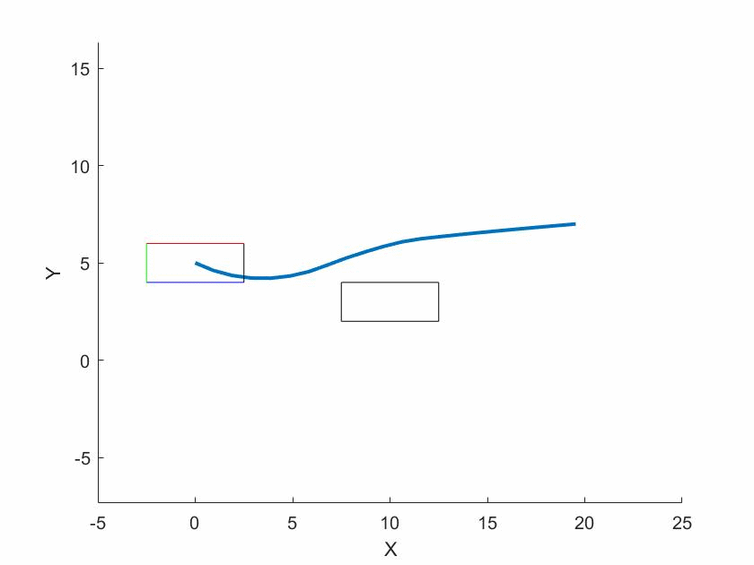

# vehicle-dynamics-casadi
An implementation of vehicle dynamics models with casadi

An example of a simple vehicle doing collision avoidance (example 2):


## MATLAB Casadi Interface
This repo uses the MATLAB Interface of Casadi to implement vehicle dynamics and do interesting simulations such as vehicle collision avoidance.

## Try the Demos
To get quickly started, open your MATLAB and navigate to the `examples` folder, open one of the following MATLAB livescript files and just hit `Run`:
```
ex1_static_obstacle 	% box-like simple vehicle (5-states) avoiding a static obstacle
ex2_moving_obstacle 	% box-like simple vehicle (5-states) avoiding a moving obstacle
ex3_static_obstacle_linear_tire 	% vehicle with a linear tire model (9-states) avoiding a static obstacle
```

## Issues:
[-] (resolved) Currently, example 1 and example 2 works fine, but example 3 is struggling with feasible Casadi solutions. Any help is appreciated.